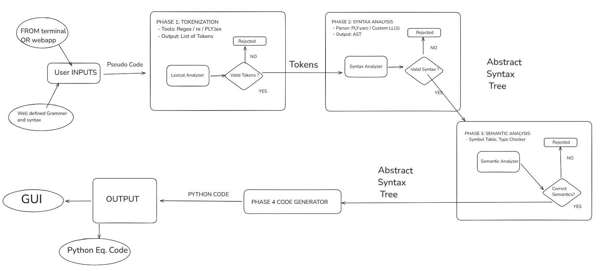

# PseudoTranspiler
🔧 Converts pseudocode to Python using compiler design principles.


## APPROACH : 
1.	Input  : We begin with a well-defined grammar and syntax for our pseudocode language (inspired by common educational styles like pseudocode) which will be inputed from terminal / file / web app
2.	 Lexical Analysis : Using this grammar, we will implement a lexical analyzer using Python’s re module or libraries like PLY.lex (Python Lex-Yacc) to tokenize the input into well defined tokens of the language. 
3.	Syntax Analysis :These tokens will be passed to a parser built with PLY.yacc or a custom parser ( top down or bottom up) that constructs an Abstract Syntax Tree (AST) representing the structure of the pseudocode.
4.	Semantic Analysis  :The semantic analyzer will traverse the AST to perform type checks, scope validation, and other logical validations using symbol tables. 
5.	Code Generation : Once verified, the code generation phase will translate the AST into clean, equivalent Python code using a template-based or tree-walk approac

## SYSTEM ARCHITECTURE


## PSEUDOCODE STANDARD

This portion will keep on updating as new features are added. Till this point we have:

---

### 1. Variables  
**Declaration and Assignment**:
```
SET x TO 10  
SET y TO x + 5
```

**Input**:
```
INPUT <variable>
```

**Output**:
```
PRINT <expression>
```

---

### 2. Conditionals  
**If-Else Statement**:
```
IF <condition> THEN
    <statements>
ELSE
    <statements>
END
```
*(If-Else ladder will be added later)*

---

### 3. Iteratives  
**While Loop**:
```
WHILE <condition> DO
    <statements>
END 
```
*(For loop will be added later)*

---

### 4. Expressions & Operators  
**Structure**:
```
<term> <operator> <term>  
OR  
<single term>
```

**Terms**: Variables, numbers, strings (in quotes)  
**Operators**:  
- Arithmetic: `PLUS`, `MINUS`, `MULTIPLY`, `DIVIDE`, `MOD`  
- Comparison: `EQ`, `NE`, `GT`, `LT`, `GE`, `LE` , 'TYPE_EQ'
